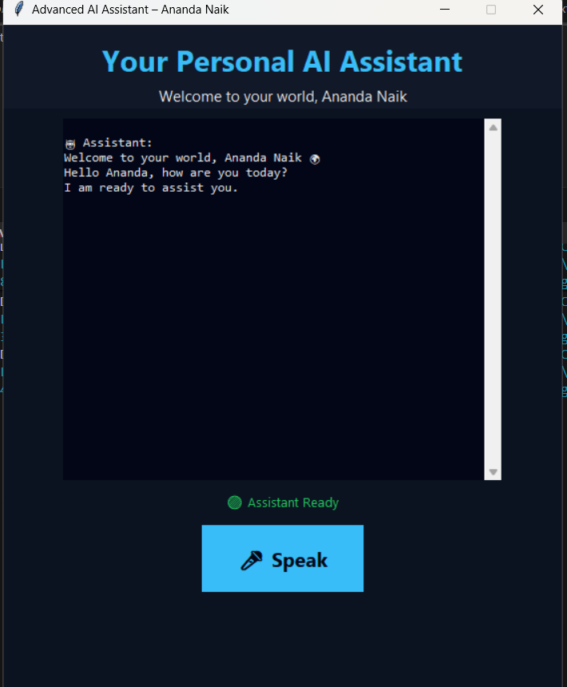
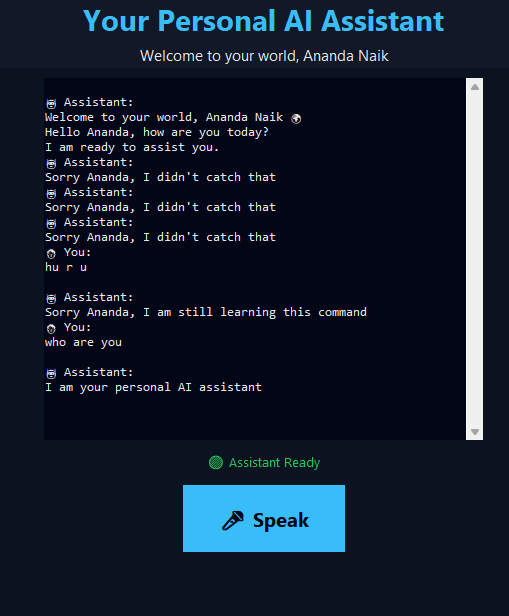
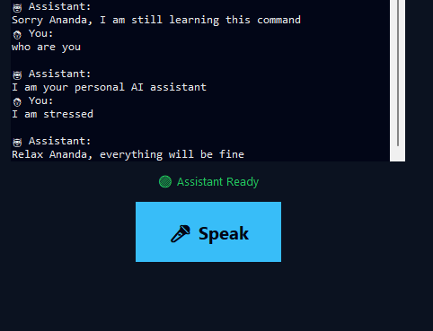
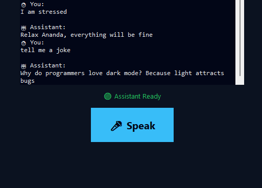
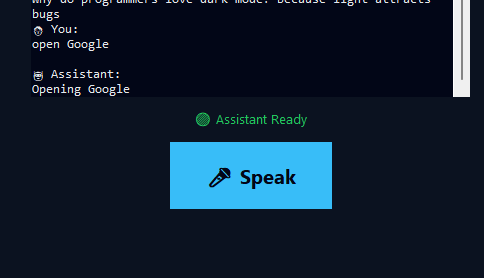
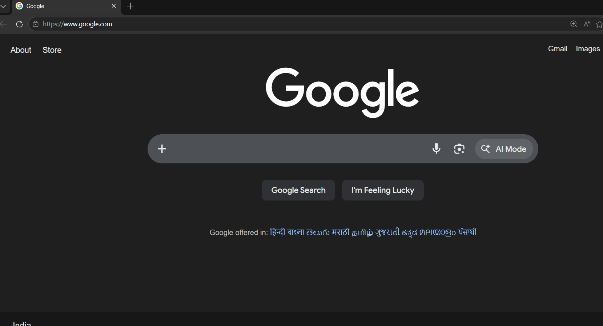

# U NEED ASSISTANT  
## AI Based Personal Assistant for Ananda Naik

---

## 📌 Project Description
U NEED ASSISTANT is an AI-based personal voice assistant developed using Python.  
It is designed to interact with the user through voice commands and provide responses using speech output.  
The assistant is personalized for **Ananda Naik** and provides a modern graphical user interface.

---

## 📸 Screenshots

### 🏠 Home Screen

### 💬 Chat Interface

### 🎤 Voice Listening Mode

### 🧠 AI Thinking State

### 🌐 Web Commands Execution

### 🎨 UI Design Preview

🎨 UI Design Preview

## 🎯 Objectives
- To build a personalized AI voice assistant  
- To enable human–computer interaction using voice  
- To perform basic tasks using AI logic  
- To provide a modern and interactive frontend design  

---

## 🧠 Features
- Personalized greeting for Ananda Naik  
- Voice input using microphone  
- Voice output using text-to-speech  
- Tells current time and date  
- Opens Google and YouTube  
- Interactive GUI frontend  
- Exit command support  

---

## 🛠️ Technologies Used
- Python  
- Tkinter (GUI)  
- SpeechRecognition  
- pyttsx3  
- PyAudio  

---

## 🖥️ System Requirements
- Windows 10 / 11  
- Python 3.9 or above  
- Microphone  
- Internet connection  

---

## 📂 Project Structure
